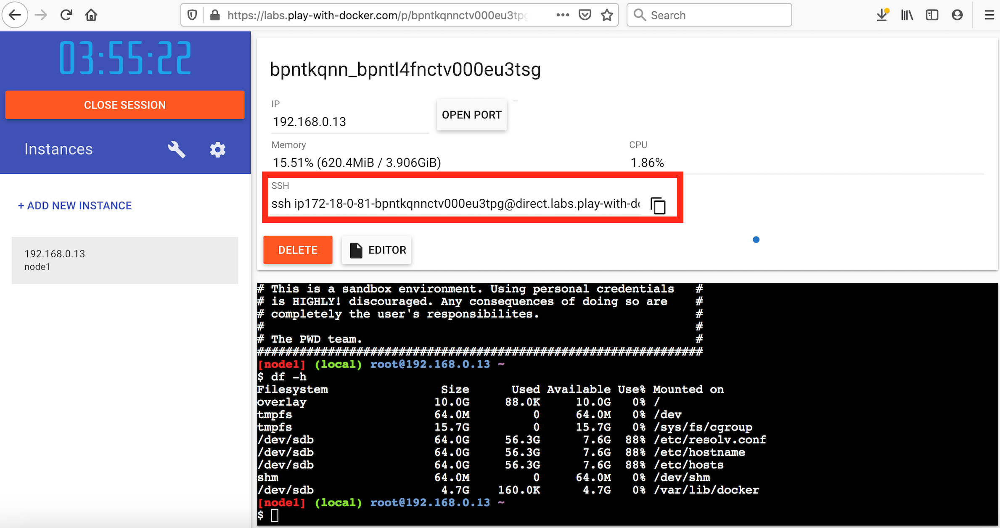
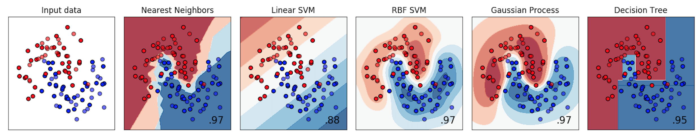

# Initial setup
First, make a directory for this tutorial, eg. `uvic_analysis_preservation`, and make a directory named `scripts` to contain any python scripts you use for the tutorial:

~~~bash
cd ..
mkdir uvic_analysis_preservation
cd uvic_analysis_preservation
mkdir scripts
cd scripts
~~~

# ML Classification Analysis

The analysis we'll work with in this tutorial is adapted from an [sklearn classifier comparison example](https://scikit-learn.org/stable/auto_examples/classification/plot_classifier_comparison.html#sphx-glr-auto-examples-classification-plot-classifier-comparison-py). A few different classifiers are compared for establishing spatial decision boundaries in 2d space using datapoints scattered in the 2d space with binary labels. 

The code to run the full analysis can be downloaded from github:

~~~bash
wget https://raw.githubusercontent.com/danikam/ml_workflows/master/scripts/full_run.py
~~~

Take a moment to look through the code and get a feel for what it's doing. If using play-with-docker, you can use the 'Editor' button to open up a window that lets you navigate through the filesystem and open files.

Basically, the script is downloading an input file ([link to file here](https://www.dropbox.com/s/ovyxd3q4td7jd3m/moon.txt?dl=1)) containing 100 datapoints with (x,y) coordinates and binary labels, then fitting the data with a few machine learning classifiers to get decision functions to classify an datapoint given its (x,y) coordinates. The decision functions are visualized and plotted. 

Ok, enough chit-chat - let's try running the code! 

First we'll need to set up the right enviroment, so let's start with the [python 3.7 base image](https://hub.docker.com/layers/python/library/python/3.7/images/sha256-70d6722ecc9641c47c30f59922afd3d439619e505243414c907a59361fb2bbfa?context=explore), which has python 3.7 pre-installed on an ubuntu operating system. On top of that, we'll need to add a few python modules used by the code. Remember, we'll need to volume-mount our current working directory into the container so it has access to our code.

~~~bash
docker run --rm -it -v $PWD:/fun_with_ml python:3.7-slim /bin/bash
pip install numpy matplotlib scikit-learn click
~~~

Now, run the python script in the container, giving the download url of the input dataset and path to the output file as arguments:

~~~
cd /fun_with_ml
python full_run.py --dataset https://www.dropbox.com/s/ovyxd3q4td7jd3m/moon.txt?dl=1 --outfile ml_output.png
~~~

If using a play-with-docker session, you can now copy the output to your local computer using the ssh link provided in the session to visualize it. 

 

Eg. on your local machine:

~~~bash
scp ip172-18-0-81-bpntkqnnctv000eu3tpg@direct.labs.play-with-docker.com:~/uvic_analysis_preservation/scripts/*.png .
open ml_output
~~~

The output should look like this:

Now, back in the container, you can exit out:

~~~bash
exit
~~~


