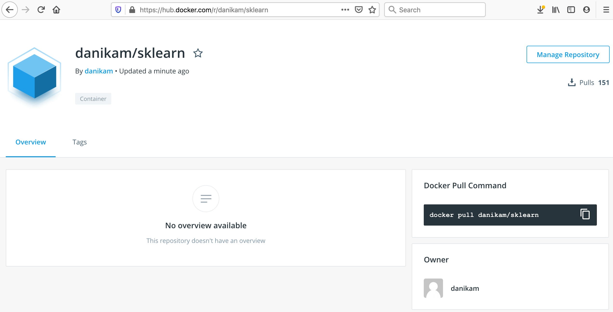

# Customizing our Analysis Image
As we've seen, it's pretty quick to 'manually' customize the `python:3.7` base image to run our analysis code, we just need to do a few `pip` installs. But eventually it would get annoying to have to re-do these pip installs every time we want to bring up a new container to run the code. So let's just do it once and for all with a Dockerfile.

~~~bash
docker tag <SOURCE_IMAGE[:TAG]> <TARGET_IMAGE[:TAG]>
~~~
{: .source}

> ## Make your analysis image
>
> Go to the top level of your tutorial directory, and create a `Dockerfile`
>
> ~~~bash
> cd ..
> touch Dockerfile
> ~~~
>
> Using the [Dockerfile syntax we saw earlier](../02-docker-intro/#writing-dockerfiles-to-build-images) add commands to the Dockerfile to create an image based on the `python:3.7-slim` image with:
> * all our needed python modules (`numpy`, `matplotlib`, `scikit-learn`, and `click`) installed, and 
> the contents of the `scripts` directory located in a directory named `/fun_with_ml` on the image.
>
>
> ### Build the image
> 
> Build the image using the `docker build` command, and name the image `[your_dockerhub_username]/sklearn`.
>
> > ## Solution
> >
> > The Dockerfile should look something like
> > 
> > ~~~yaml
> > # Dockerfile 
> > FROM python:3.7-slim
> > RUN pip install numpy matplotlib scikit-learn click
> > COPY scripts /fun_with_ml
> > ~~~
> > {: .source}
> > 
> > and the docker build command should look, for example, like:
> > 
> > ~~~bash
> > docker build -t danikam/sklearn .
> > ~~~
> > {: .source}
> {: .solution}
{: .challenge}

Now, push your image up to docker hub using the `docker push` command. First, you'll need to log in to the docker registry using your docker hub credentials: 

~~~bash
docker login -u [your_docker_hub_username]
docker push [your_dockerhub_username]/sklearn
~~~

Once the push is finished, you can check that the image is now available on the public docker hub registry: https://hub.docker.com/r/[your_docker_hub_username]/sklearn


