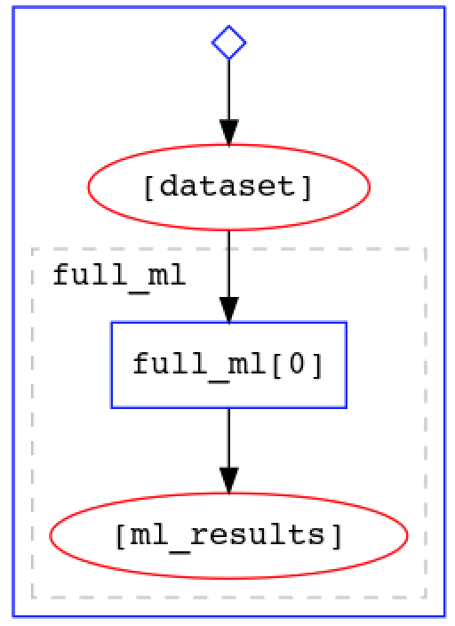

# Yadage

In this tutorial, we'll use yadage to run and execute our analysis workflow. 

[Yadage](https://yadage.readthedocs.io/en/latest/) is both:
* a yaml-based syntax for describing workflows made up of containerized steps, and
* an execution engine for actually running these workflows.

In the yadage approach, the workflow is divided into distinct steps, called packaged activities - or "packtivities" - each of which will run inside a docker container. The steps, encoded with a `steps.yml` file get linked into a workflow, encoded with a `workflow.yml` file, by specifying how the output from each such packtivity step feeds in as the input for subsequent steps. 

This flow of dependencies is not necessarily linear. The yadage workflow engine optimizes the execution of the workflow by running steps in parallel whenever possible. 

> ## More reading on Yadage
> Nice introductory yadage tutorial: [https://yadage.github.io/tutorial/](https://yadage.github.io/tutorial/)
>
> [Yadage and Packtivity – analysis preservation using parametrized workflows](https://arxiv.org/pdf/1706.01878.pdf) (paper on arXiv with lots of great background info)
{: .callout}

# Designing a one-step workfklow
Since we only have one analysis image, we can in principle do the entire analysis workflow in one step (i.e. input --> analysis in container --> output). 

From the top level of your analysis directory, make a new sub-directory named `workflow_onestep` to contain the spec file for the one-step workflow, and `cd` into it:

~~~bash
mkdir workflow_onestep
cd workflow_onestep
~~~

Make a `steps.yml` file for our one-step workflow:

~~~bash
touch steps.yml
~~~

copy the following content into it:

~~~yaml
full_ml_step:
  process:
    process_type: 'interpolated-script-cmd'
    script: |
      python /fun_with_ml/full_run.py --dataset {input_dataset} --outfile {outfile}
  environment:
    environment_type: 'docker-encapsulated'
    image: danikam/sklearn
    imagetag: latest
  publisher:
    publisher_type: interpolated-pub
    publish: 
      ml_results: '{outfile}'
~~~

In the steps file:
 
* **`process`:** specifies the type and content of the process that the container will run. The `interpolated-script-cmd` type means that it runs a bash script that can include variables denoted by {curly brackets}. 
<!--This is quite possibly the only type of process you'll ever need to use for RECAST.-->

* **`publisher`:** specifies how the output of the step will be published (in this case `interpolated-pub`), and what variable(s) it will be published to. 

* **`environment`:** indicates that the script will be run inside a docker container produced from the image `danikam/sklearn`.

Also make corresponding `workflow.yml` file:

~~~bash
touch workflow.yml
~~~

and copy the following content into it:

~~~yaml
stages:
- name: full_ml
  dependencies: [init]
  scheduler:
    scheduler_type: singlestep-stage
    parameters:
      outfile: '{workdir}/ml_results.png'
      input_dataset: {step: init, output: dataset}
    step: {$ref: 'steps.yml#/full_ml_step'}
~~~

The workflow encodes:

* its `dependencies` - i.e. which stage(s) it receives input from, and which will therefore need to complete before the stage in question can start running. The [init] stage represents any input that comes from the user when the workflow is started. 
* The type `scheduler_type` of scheduler it needs to run. This could be either a `singlestep-stage` or a `multistep-stage` (we'll get to multistep-stage later).
* The `parameters` - i.e. how to obtain the input and write the output for the step. 
* And, of course, which step in the `steps.yml` file it needs to run. 

## Running the workflow

We'll use the `yadage/yadage` docker container, which comes pre-installed with yadage, to run the workflow with the native yadage backend. The command to start this container is a bit lengthy, because we also need to mount the docker daemon into it (`-v /var/run/docker.sock:[...]`) and set an environment variable (`-e PACKTIVITY_WITHIN_DOCKER=true`):

~~~bash
cd /root/uvic_analysis_preservation
docker run --rm -it -e PACKTIVITY_WITHIN_DOCKER=true -v $PWD:$PWD -w $PWD -v /var/run/docker.sock:/var/run/docker.sock yadage/yadage sh
~~~

Now, from inside the yadage container, run the workflow as follows:

~~~bash
cd workflow_onestep
yadage-run -p dataset='https://www.dropbox.com/s/ovyxd3
q4td7jd3m/moon.txt?dl=1' --visualize
~~~

The output should look like:

~~~
2020-03-16 22:02:48,106 | packtivity.asyncback |   INFO | configured pool size to 8
2020-03-16 22:02:48,196 |      yadage.creators |   INFO | initializing workflow with initdata: {u'dataset': 'https://www.dropbox.com/s/ovyxd3q4td7jd3m/moon.txt?dl=1'} discover: True relative: True
2020-03-16 22:02:48,197 |    adage.pollingexec |   INFO | preparing adage coroutine.
2020-03-16 22:02:48,197 |                adage |   INFO | starting state loop.
2020-03-16 22:02:48,234 |     yadage.wflowview |   INFO | added </init:0|defined|unknown>
2020-03-16 22:02:48,441 |     yadage.wflowview |   INFO | added </full_ml:0|defined|unknown>
2020-03-16 22:02:48,572 |    adage.pollingexec |   INFO | submitting nodes [</init:0|defined|known>]
2020-03-16 22:02:48,657 |       pack.init.step |   INFO | publishing data: <TypedLeafs: {u'dataset': u'https://www.dropbox.com/s/ovyxd3q4td7jd3m/moon.txt?dl=1'}>
2020-03-16 22:02:48,845 |           adage.node |   INFO | node ready </init:0|success|known>
2020-03-16 22:02:48,845 |    adage.pollingexec |   INFO | submitting nodes [</full_ml:0|defined|known>]
2020-03-16 22:02:48,848 |    pack.full_ml.step |   INFO | starting file logging for topic: step
2020-03-16 22:03:03,308 |           adage.node |   INFO | node ready </full_ml:0|success|known>
2020-03-16 22:03:03,328 | adage.controllerutil |   INFO | no nodes can be run anymore and no rules are applicable
2020-03-16 22:03:03,328 |    adage.pollingexec |   INFO | exiting main polling coroutine
2020-03-16 22:03:03,329 |                adage |   INFO | adage state loop done.
2020-03-16 22:03:03,329 |                adage |   INFO | execution valid. (in terms of execution order)
2020-03-16 22:03:03,329 | adage.controllerutil |   INFO | no nodes can be run anymore and no rules are applicable
2020-03-16 22:03:03,329 |                adage |   INFO | workflow completed successfully.
2020-03-16 22:03:03,329 |  yadage.steering_api |   INFO | done. dumping workflow to disk.
2020-03-16 22:09:31,651 |  yadage.steering_api |   INFO | visualizing workflow.
~~~
{: output}

Now, if you do an `ls`, you'll see that there's a new directory named `workdir`. 

You can now exit out of the yadage container:

~~~bash
exit
~~~

On your local machine, download the whole directory (if using play-with-docker) and see what's inside it (note that your exact scp command will be slightly different):

~~~bash
scp -r ip172-18-0-81-bpntkqnnctv000eu3tpg@direct.labs.play-with-docker.com:/root/uvic_analysis_preservation/workflow_onestep/workdir .
~~~

~~~bash
ls workdir
~~~

~~~
_yadage  full_ml  init
~~~
{: .output}

~~~bash
ls workdir/_yadage/
~~~

~~~
adage                          yadage_template.json           yadage_workflow_instance.pdf
yadage_snapshot_workflow.json  yadage_workflow_instance.dot   yadage_workflow_instance.png
~~~
{: .output}

Among other things, the `_yadage` directory contains a visual workflow representation `yadage_workflow_instance.png`, which should look like:

You can also verify that the output, contained under `workdir/full_ml/ml_results.png` looks as expected.


