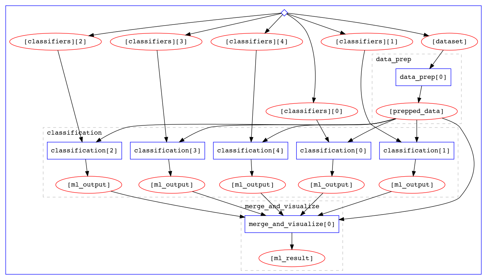
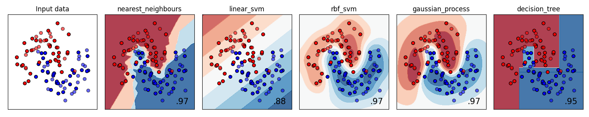

# Going beyond a one-step workflow

You've now fully preserved our analysis code and environment in a docker image. The analysis workflow is fully automated with the one-step `steps.yml` and `workflow.yml` files we've created, and produces the expected output in a reasonable amount of time. So in principle, your work is done - you've successfully preserved this analysis! 

But before we share a celebratory hoorah and disperse, I want to give you a taste of how this simple workflow could be optimized if we found ourselves facing a more computationally intensive analysis (think fraction-of-second ML training --> several hours). 

# Modularizing the workflow

In the current analysis code, the data preparation and ML training are all done in the same python script. This is fine for our analysis, since both steps take a fraction of a second. But what if the data preparation actually took an hour? It would be super annoying to have to wait for the data preparation to finish if you just wanted to test some aspect of the ML training in the workflow. Same thing with visualizing the results - who wants to wait a day for their ML training to finish just to check that the new x-axis label doesn't run off the canvas?

Yadage includes a tool called `packtivity-run` to run individual workflow steps in isolation for development and debugging. To take advantage of this isolation, we can start by separating the data preparation, ML training, and visualization of results into distinct steps:

[Link to data preparation script](https://raw.githubusercontent.com/danikam/ml_workflows/master/scripts/data_prep.py)

[Link to ML training script](https://raw.githubusercontent.com/danikam/ml_workflows/master/scripts/classification.py)

[Link to visualization script](https://github.com/danikam/ml_workflows/blob/master/scripts/merge_and_plot.py)

Go into the `scripts` directory, and download the code for each step:

~~~bash
cd scripts
wget https://raw.githubusercontent.com/danikam/ml_workflows/master/scripts/data_prep.py
wget https://raw.githubusercontent.com/danikam/ml_workflows/master/scripts/classification.py
wget https://raw.githubusercontent.com/danikam/ml_workflows/master/scripts/merge_and_plot.py
~~~

Since we've added more scripts, re-build the docker image so it includes these new scripts:

~~~bash
cd ..
docker build -t [your_docker_hub_username]/sklearn .
docker push [your_docker_hub_username]/sklearn
~~~

# Divide and conquer

The original analysis code loops over all 5 classifiers sequentially and fits each to the data. This is just shouting to be parallelized. 

One of the strengths of yadage is how readily it accommodates workflow parallelization. So rather than looping over classifiers, the ML training step has been updated to receive a single classifier to train as input, and use yadage to parallelize the training over all 5 classifiers:

In the code, the `for` loop over all classifiers

~~~python
# iterate over classifiers                                                                                                                                                         
for name, clf in zip(names, classifiers):
~~~

gets replaced with an input argument to the [ML training script](https://raw.githubusercontent.com/danikam/ml_workflows/master/scripts/classification.py) specifying which classifier to use:

~~~python
@click.option(
              '--classifier',
              help='name of classifier to use',
              default='Nearest Neighbors'
              )
~~~

# Workflow specs

Make a new directory to contain the parallelized workflow and `cd` into it:

~~~bash
cd ~/uvic_analysis_preservation
mkdir workflow_parallel
cd workflow_parallel
~~~

Create a new set of `steps.yml` and `workflow.yml` files with three steps defined:

`steps.yml`:

~~~yaml
data_prep_step:
  process:
    process_type: 'interpolated-script-cmd'
    script: |
      python /fun_with_ml/data_prep.py --dataset {dataset} --outfile {outfile}
  environment:
    environment_type: 'docker-encapsulated'
    image: danikam/sklearn
    imagetag: latest
  publisher:
    publisher_type: interpolated-pub
    publish: 
      prepped_data: '{outfile}'

classification_step:
  process:
    process_type: 'interpolated-script-cmd'
    script: |
      for classifier in {all_classifiers}; do
        python /fun_with_ml/classification.py --prepped_data {input_data} --classifier $classifier --outfile {outdir}/$classifier.pkl
      done
  environment:
    environment_type: 'docker-encapsulated'
    image: danikam/sklearn
    imagetag: latest
  publisher:
    publisher_type: interpolated-pub
    publish:
      ml_output: '{outdir}/*.pkl'

merging_step:
  process:
    process_type: 'interpolated-script-cmd'
    script: |
      python /fun_with_ml/merge_and_plot.py {input_data} {outfile} {ml_inputs}
  environment:
    environment_type: 'docker-encapsulated'
    image: danikam/sklearn
    imagetag: latest
  publisher:
    publisher_type: interpolated-pub
    publish:
      ml_result: '{outfile}'
~~~

`workflow.yaml`:

~~~yaml
stages:
- name: data_prep
  dependencies: [init]
  scheduler:
    scheduler_type: singlestep-stage
    parameters:
      dataset: {step: init, output: dataset}
      outfile: '{workdir}/prepped_data.pkl'
    step: {$ref: 'steps.yml#/data_prep_step'}

- name: classification
  dependencies: [data_prep, init]
  scheduler:
    scheduler_type: multistep-stage
    parameters:
      input_data: {step: data_prep, output: prepped_data}
      all_classifiers: {step: init, output: classifiers}
      outdir: '{workdir}'
    scatter:
      method: zip
      parameters: [all_classifiers]
    step: {$ref: 'steps.yml#/classification_step'}

- name: merge_and_visualize
  dependencies: [classification, data_prep]
  scheduler:
    scheduler_type: singlestep-stage
    parameters:
      input_data: {step: data_prep, output: prepped_data}
      ml_inputs: {stages: classification, output: ml_output, flatten: true}
      outfile: '{workdir}/ml_results.png'
    step: {$ref: 'steps.yml#/merging_step'}
~~~

We'll also add new file called `inputs.yml` which encodes the workflow arguments (as an alternative to supplying them on the command line as we did before):

`inputs.yml`:

~~~yaml
dataset: 'https://www.dropbox.com/s/ovyxd3q4td7jd3m/moon.txt?dl=1'
classifiers:
  - 'nearest_neighbours'
  - 'linear_svm'
  - 'rbf_svm'
  - 'gaussian_process'
  - 'decision_tree'
~~~

Intermediate output from the `data_prep` and `classification` stages is now saved as python pickle files, which get passed on to subsequent stages. 

This workflow is getting pretty complex, and I don't expect you to follow it in gory detail. What I'd like to highlight though is that the `workflow.yml` now uses the `multistep-stage` scheduler type and a new `scatter` field to tell yadage to run the ML training (a.k.a. "classification") step over the five classifiers in parallel. The `merge_and_visualize` step then uses the `flatten: true` specification for the `ml_inputs` parameter representing the five output files with results from parallelized ML training step to read in these files as a flattened list and then visualize them side-by-side.  

You can visualize all of this by running the workflow with yadage and looking at the generated workflow diagram in `workdir/_yadage/yadage_workflow_instance.pdf`:

~~~bash
docker run --rm -it -e PACKTIVITY_WITHIN_DOCKER=true -v $PWD:$PWD -w $PWD -v /var/run/docker.sock:/var/run/docker.sock yadage/yadage sh
yadage-run workdir workflow.yml inputs.yml --visualize
~~~

You can also verify that the visualization of the ML training results located in `workdir/merge_and_visualize/ml_results.png` looks as expected:


